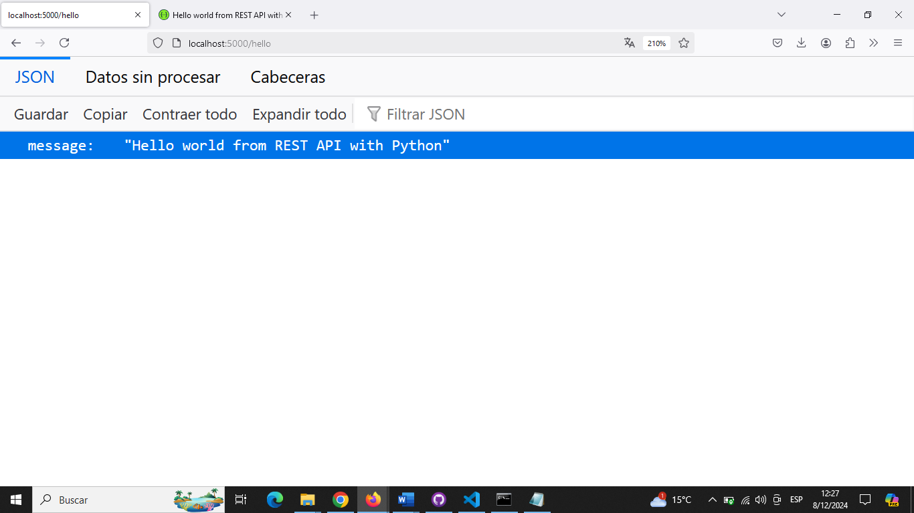
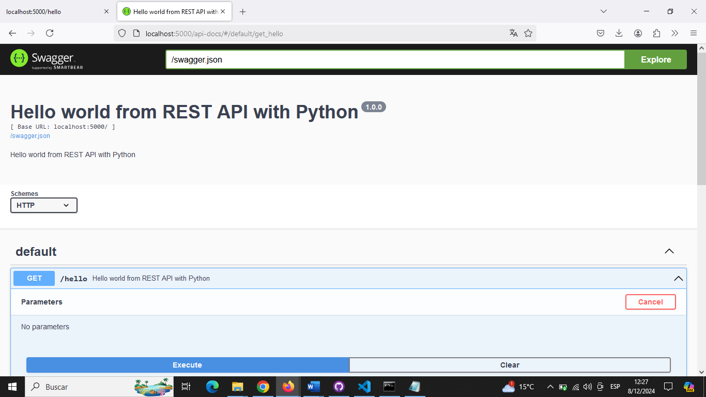

# EA1RestAPI

Este proyecto es una API REST básica desarrollada con **Python** y **Flask**, que sigue el estilo arquitectónico REST y utiliza **Swagger** para la documentación interactiva.

## Estructura del Proyecto

- `app.py`: El archivo principal con la lógica de la API, donde se configuran los endpoints.
- `swagger.json`: El archivo que define la documentación Swagger de la API.
- `README.md`: Documentación del proyecto y las instrucciones para la ejecución.

## Requisitos Previos

Antes de ejecutar este proyecto, asegúrate de tener instalados los siguientes programas:

- **Python** (versión 3.8 o superior). Puedes descargarlo desde [python.org](https://www.python.org/downloads/).
- **Pip** (administrador de paquetes de Python).
- **Visual Studio Code** o cualquier editor de texto de tu preferencia.

## Ejecución Manual desde el Código

1. **Descargar el Proyecto desde GitHub**:

    1.1. Descargando archivo zip
    - Ve al repositorio en GitHub y haz clic en **"Code"**. Luego selecciona **"Download ZIP"** para descargar el proyecto a tu computadora.
    - Extrae el archivo ZIP en la carpeta de tu elección.

    1.2. Clonar el repositorio usando comandos
    - Clona este repositorio en tu máquina local usando el siguiente comando:
    ```bash
    git clone https://github.com/meybili19/EA1RestAPI.git
    ```

2. **Descargar Python en VS Code**:

   - Dirigete a Extensiones y elige Python, descargalo.

3. **Instalar las Dependencias**:

   - Instala las dependencias necesarias ejecutando dentro de una terminal en VS Code:

     ```bash
     pip install flask flask-restful flask-swagger-ui
     ```

4. **Ejecutar el REST API**:

   - Inicia el servidor Flask ejecutando:

     ```bash
     python app.py
     ```

   - La API estará disponible en `http://localhost:5000`.

   - La documentación interactiva Swagger estará disponible en `http://localhost:5000/api-docs`.

5. **Visualización de ejecución**:




## Credits

This project was developed by Meybili Olivares (https://github.com/meybili19).

